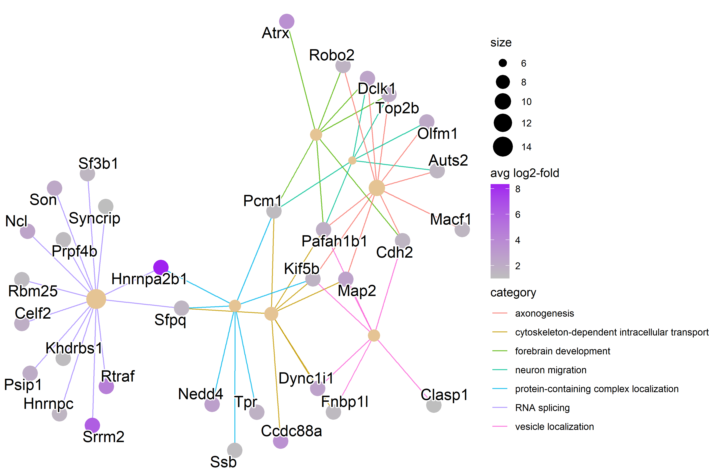
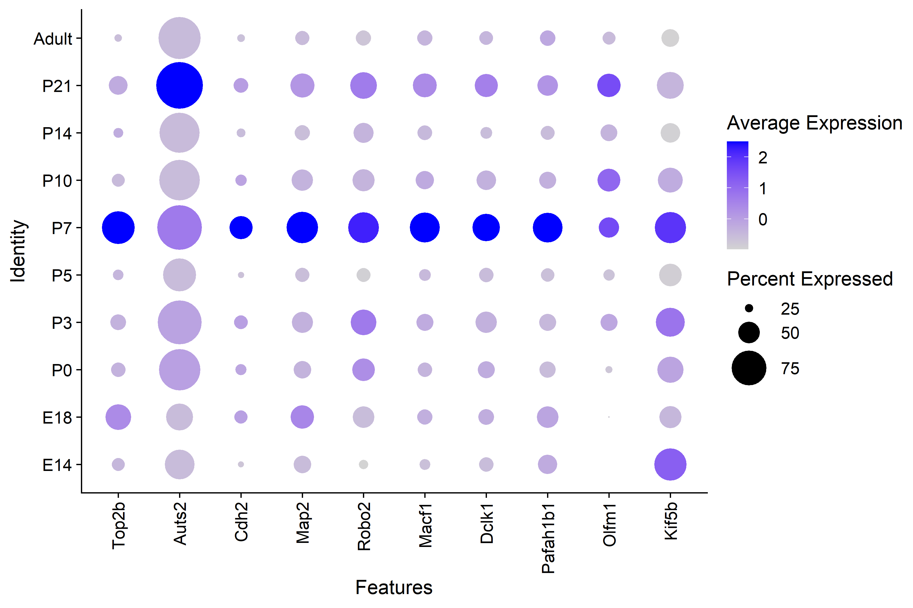
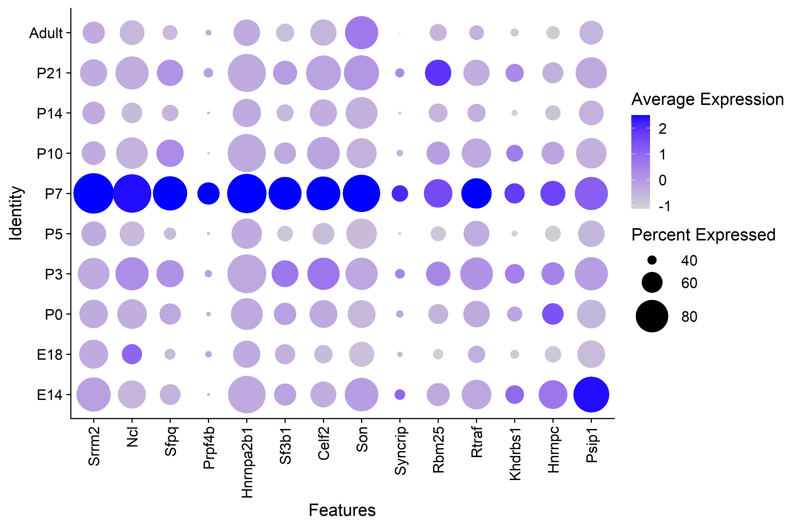
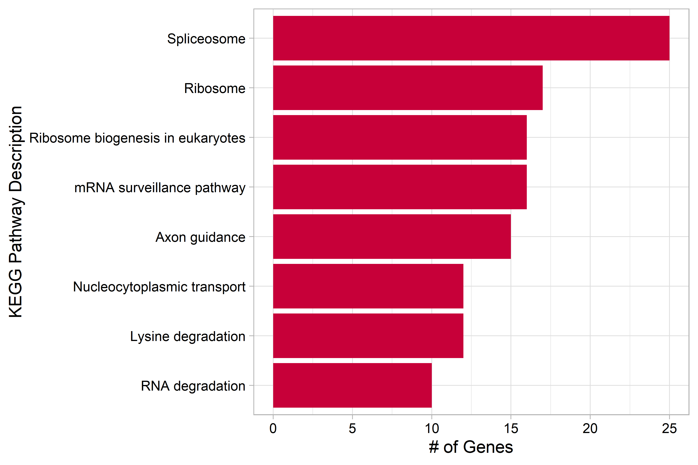
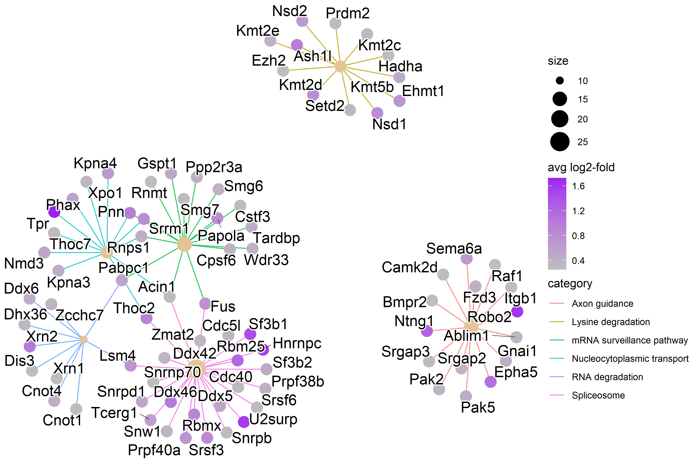
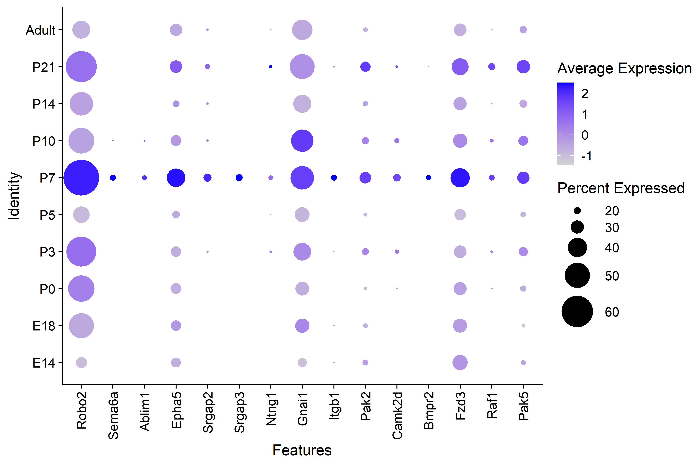

# Supplementary Analysis   

*This page contains additional analysis not included in the original poster*   

### GO and KEGG analysis of P7 Interneurons   

| Figure 1. GO term analysis of overexpressed genes in the P7 cluster | 
|:--:|
|  |
| *Genes that were differentially overexpressed in the P7 cluster at least 2-fold on average (p < 0.01) were used for over representation analysis (ORA). The 20 terms with the most genes are shown here.*|

&nbsp;

| Figure 2. Network Plot of Relevant P7 GO terms| 
|:--:|
|  |
| *RNA splicing genes have higher expression levels than the other categories.*|

&nbsp;

| Figure 3 GO Term Axonogenesis Genes by Timepoint| 
|:--:|
|  |
| *There is clear higher average expression in P7 interneurons for GO axonogenesis genes with the exception of Auts2.*|
  

&nbsp;
 
| Figure 4. GO Term RNA Splicing Genes by Timepoint| 
|:--:|
|  |
| *There is clear higher average expression in P7 interneurons for GO RNA splicing genes.*|

| Figure 5. KEGG Pathways overexpressed in the P7 cluster |  
|:--:|
|  |
| *Genes that were differentially overexpressed in the P7 cluster (p<0.01) were used for over representation analysis (ORA).*|

&nbsp;

| Figure 6. Network Plot of KEGG Pathways in P7 cluster| 
|:--:|
|  |
| *RNA splicing KEGG pathways have high expression.*|

&nbsp;

| Figure 7. KEGG Axon Guidance Genes by Timepoint| 
|:--:|
|  |  
| *The P7 interneurons have higher average expresssion across all of the genes in the axon guidance KEGG pathway.*|

Genes involved in axonogenesis and RNA splicing have higher average expression in the P7 interneurons found through both KEGG pathway and GO term ORA . These results suggest that there may be P7 specific RNA splicing involved in the critical period of olfactory map formation.
