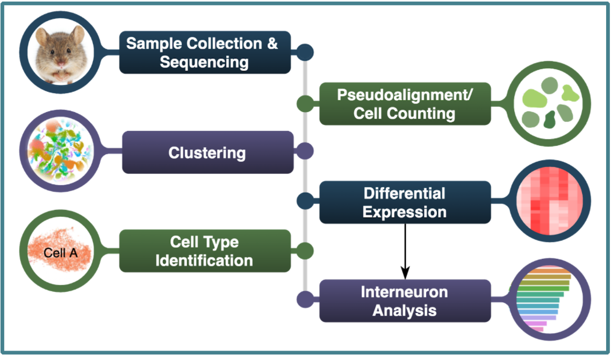
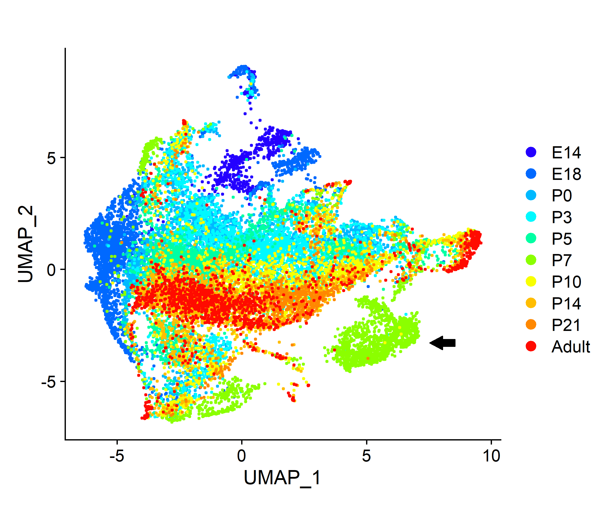

## Characterizing Interneuron Expression in the Developing Olfactory Bulb  
#### Contributors: Laura Paez, Natalie Elphick and Christina Zakarian  

  

## Background   
#

Interneurons are a diverse cell population that make up the majority of neurons in the body. They relay information between sensory and motor neurons, making them necessary for complex processing and response. Interneurons are indispensable for learning, memory, and cognition. The critical period is a short time period, closing 7 days after birth, where sensory inputs help shape a functional olfactory system. Perturbations targeting axon projections after the critical period disrupt olfactory map formation3, 5. Here we used single-cell RNA-sequencing (scRNA-Seq) data from the mouse olfactory bulb (OB) to identify cell types and conducted differential expression (DE) analysis in the interneuron subpopulation across 10 developmental timepoints, spanning embryonic (E14 and E18) and post-birth  (P0 to Adult) timepoints. 

  

## Workflow 
#   
  
  
OBs of mice from 10 timepoints were dissected and sequenced using scRNA-Seq using the 10X Chromium droplet based library preparation1. Data from merged technical replicates was pseudoaligned 4, 6. Clustering,  differential expression analysis, and cell type identification using marker genes was performed on 37,730 cells, followed by additional analysis on the subset of 19,554 interneuron cells.    

  
   

  

## Results  
#

  

| Figure 1. UMAP of interneurons by timepoint.| 
|:--:|
|    | 
|  *Interneurons identified through DE analysis  were re-clustered and labeled by timepoint. Timepoints segregate between pre-critical (E14 to P5) and post-critical period (P7 to Adult). P7 has a distinct shared nearest neighbor (sNN) cluster (arrow).* |

   

| Figure 2. GO term analysis of overexpressed genes in the P7 cluster.| 
|:--:|
|  |
| *Genes that were differentially overexpressed in the P7 cluster at least 2-fold on average (p < 0.01) were used for over representation analysis (ORA). The 20 terms with the most genes are shown here.*|

  

## Methods   
#

### Preprocessing  

We performed 10x Genomics Cell Ranger 6.1.1 and kallisto \| bustools preprocessing to compare the resulting count matrices using the most recent ensembl release (104) of the mus musculus genome GRCm39. We then filtered the empty droplets from the kb count ouput and saved the outputs from both pipelines as RDS R objects for downstream comparison in Seurat. For additional documentation of the CellRanger or kallisto \| bustools preprocessing steps click the following links:   
<a href="https://natalie-23-gill.github.io/scRNA_Murine_Olfactory_Bulb/Preprocessing/cellranger/cellranger.html">CellRanger</a>   
<a href="https://natalie-23-gill.github.io/scRNA_Murine_Olfactory_Bulb/Preprocessing/kallisto_bustools/kallisto_bustools.html">kallisto \| bustools</a>   
The results of comparing the preprocessing pipelines show kallisto \| bustools detects more genes across the time points and had higher percent alignment to the transcriptome than CellRanger across all of the time points, to view the results of the pipeline comparison click the tab at the top of the page.   
  
### Clustering and Cell Type Identification   

After running the kallisto \| bustools preprocessing pipeline, we filtered each time point count matrix and kept the cells that met the following criteria (nFeature_RNA > 200, nCount_RNA < 10000, percent.mt < 7%). We then ran the standard Seurat v4 SCTintegration workflow, UMAP dimensionality reduction, sNN clustering and wilcoxon rank sum test differential expression on those clusters in order to identify specific cell types across the time points using known marker genes. After assigning cell types, the interneurons were seperated and reclustered.   

### GO Term Analysis

Differential expression was performed on the interneuron sNN clusters and genes that had at least 2-fold higher expression in the distinct P7 cluster (avgerage log2 fold change > 1, FDR adjusted p value < 0.01 and pct.1 > .5) were used for ORA with the R package clusterProfiler. The GO terms with p value < 0.01  and the highest gene counts are shown in Figure 2.  

  

## Acknowledgements   
#

Thank you to Dr. Ron Yu, Max Hills, and Annie Wang of the Yu Lab at the Stowers Institute for Medical Research, who provided the data and mentorship for this project.   

Our Instructors at the Knight Campus Graduate Internship Program Bioinformatics Track at the University of Oregon: Pete Batzel, Dr. Leslie Coonrod, Dr. Stacey Wagner, and Jason Sydes.  

This work benefited from access to the University of Oregon high-performance computing cluster, Talapas.   
   
  
## References  
# 

1. Zheng, G. X. Y. et al. Massively parallel digital transcriptional profiling of single cells. Nat Commun 8, 14049 (2017).  
2. Wu, Y. et al. A Population of Navigator Neurons Is Essential for Olfactory Map Formation during the Critical Period. Neuron 100, 1066-1082.e6 (2018).  
3. Tepe, B. et al. Single-Cell RNA-Seq of Mouse Olfactory Bulb Reveals Cellular Heterogeneity and Activity-Dependent Molecular Census of Adult-Born Neurons. Cell Rep 25, 2689-2703.e3 (2018).  
4. Melsted, P. et al. Modular, efficient and constant-memory single-cell RNA-seq preprocessing. Nat Biotechnol 39, 813–818 (2021).  
5. Ma, L. et al. A developmental switch of axon targeting in the continuously regenerating mouse olfactory system. Science 344, 194–197 (2014).  
6. Bray, N. L., Pimentel, H., Melsted, P. & Pachter, L. Near-optimal probabilistic RNA-seq quantification. Nat Biotechnol 34, 525–527 (2016).  

## Created: 10/07/2021
## Updated: 01/25/2021

